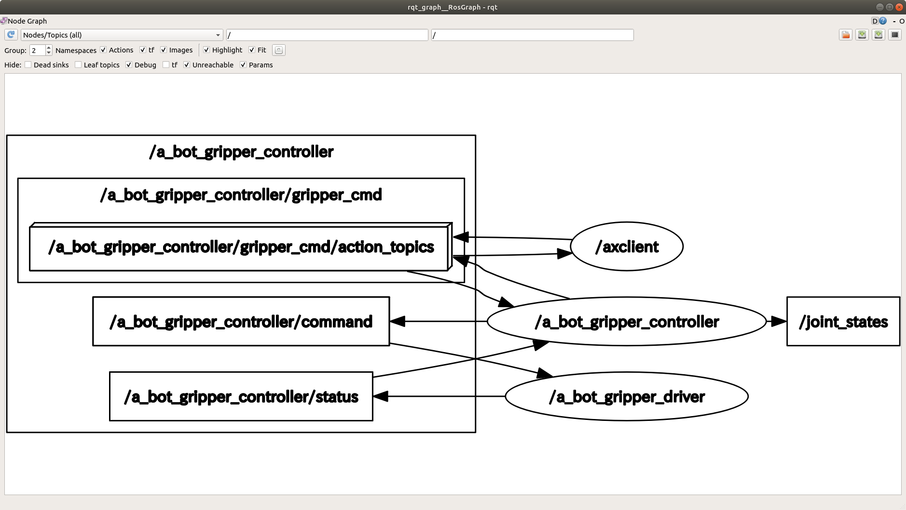
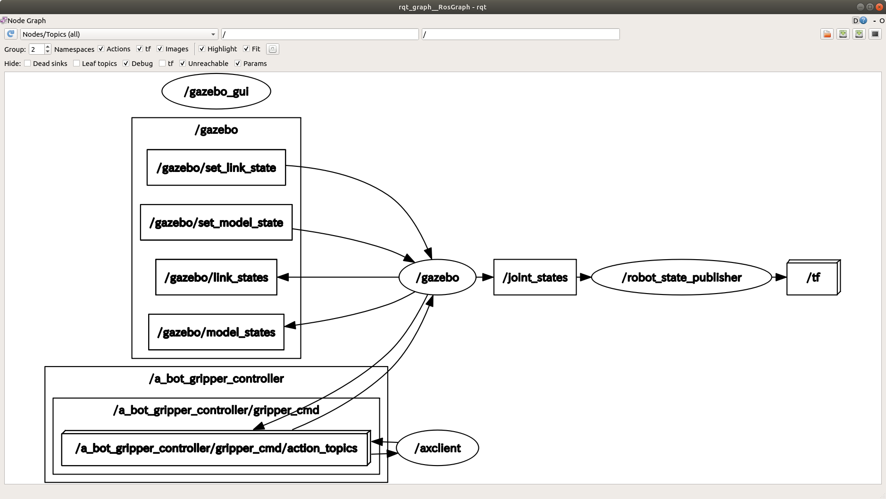

aist_robotiq: ROS action controller and driver for Robotiq two-finger grippers
==================================================

This package provides a ROS action controller and drivers for [Robotiq](https://robotiq.com) two finger grippers, [2F-85, 2F-140](https://robotiq.com/products/2f85-140-adaptive-robot-gripper) and [Hand-E](https://robotiq.com/products/hand-e-adaptive-robot-gripper). The package is forked from the [robotiq package developed by CRI group](https://github.com/crigroup/robotiq). The URCap driver is borrowed from [the code by Felix von Drigalski](https://gist.github.com/felixvd/d538cad3150e9cac28dae0a3132701cf).

## URDF

[URDF](http://wiki.ros.org/urdf) models of grippers can be found in `urdf` subdirectory. You can visualize each model by:

```
$ cd aist_robotiq/urdf
$ roslauch urdf_tutorial display.launch model:=robotiq_<device>_gripper.urdf
```

where `<device>` should be `85`, `140` or `hande`.

## Controller

The controller establishes an [ROS action](http://wiki.ros.org/actionlib) server of [control_msgs](http://wiki.ros.org/control_msgs)::[GripperCommand](http://docs.ros.org/en/api/control_msgs/html/action/GripperCommand.html) type. This action type is same as the one adopted by [gripper_action_controller](http://wiki.ros.org/gripper_action_controller) which is a part of [ros_controllers](http://wiki.ros.org/ros_controllers), a controller stack conforming to [ros_control](http://wiki.ros.org/ros_control) interface.

## Driver
The driver subscribes a command topic published by the controller and transfer it to the gripper. It also receives status from the gripper and publish it as a topic toward the controller. The following three drivers are available.

- **TCP driver** -- To be used when the gripper is connected to the [Robotiq Universal Controller](https://assets.robotiq.com/website-assets/support_documents/document/online/Controller_UserManual_HTML5_20181120.zip/Controller_UserManual_HTML5/Default.htm) which acts as a converter between TCP/IP and Modbus. Not tested.
- **RTU driver** -- Not tested.
- **URCap driver** -- To be used when the gripper is connected to the control box of [Universal Robot](https://www.universal-robots.com) CB-series or e-Series with [URCap software](https://robotiq.com/support) installed. The driver sends commands and receives status to/from the gripper via unix socket connected to the URCap server which is exposed to the port `63352` of the box.

## Gazebo plugin

Two gazebo plugins conforming to [gazebo_ros_control](http://gazebosim.org/tutorials/?tut=ros_control) are provided for simulating gripper physics:

- **gazebo_mimic_joint_plugin**
- **gazebo_disable_link_plugin**


## Usage (real gripper)
At first, you should activate the gripper hardware. If the gripper is connected to the controller box of [Universal Robot](https://www.universal-robots.com), you can do it through the URCap panel of the Teaching Pendant. 

Then you can start both the driver and the controller by typing:
```shell
$ roslaunch aist_robotiq run.launch ip:=<ip> [driver:=<driver>] [device:=<device>] [prefix:=<prefix>] 
```
where
- **ip** -- If `driver` = `urcap`, specify IP address of the controller box of [Universal Robot](https://www.universal-robots.com). Otherwise, specify IP address of [Robotiq Universal Controller](https://assets.robotiq.com/website-assets/support_documents/document/online/Controller_UserManual_HTML5_20181120.zip/Controller_UserManual_HTML5/Default.htm).
- **driver** -- Specify driver type. Currently `tcp`, `rtu` and `urcap` are supported. (default: `urcap`)
- **device** -- Specify gripper device. Currently `robotiq_85`, `robotiq_140` and `robotiq_hande` are supported. (default: `robotiq_85`)
- **prefix** -- Specify a prefix string for identifying a specific device from multiple grippers. (default: `a_bot_gripper_`)

The gripper will be automatically calibrated by fully opening and then fully closing its fingers. Encoder readings at the both ends are recorded by the controller and will be used in the subsequent grasping tasks.

Now, you can make a connection to the action server of the controller from any action clients of [control_msgs](http://wiki.ros.org/control_msgs)::[GripperCommand](http://docs.ros.org/en/api/control_msgs/html/action/GripperCommand.html) type. The simplest way for testing is invoking [actionlib](http://wiki.ros.org/actionlib)'s `axclient` by:
```
$ roslaunch aist_robotiq test.launch [prefix:=<prefix>]
```
where
- **prefix** -- Specify gripper prefix which must be same as the one given to `run.launch`. (default: `a_bot_gripper_`)

At this point, the launched nodes are connected like this:



You fill find that the gripper moves according to the goal position you give through the GUI of `axclient`.

## Usage (gazebo simulation)

You can simulate gripper motions by using [Gazebo](http://gazebosim.org/) through the following command
```
$ roslaunch aist_robotiq gazebo.launch [device:=<device>] [prefix:=<prefix>]
```
where
- **device** -- Specify gripper device. Currently `robotiq_85`, `robotiq_140` and `robotiq_hande` are supported. (default: `robotiq_85`)
- **prefix** -- Specify a prefix string for identifying a specific device from multiple grippers. (default: `a_bot_gripper_`)

This command starts 

- [gazebo](http://gazebosim.org/) for simulating gripper physics,
- [joint_state_controller](http://wiki.ros.org/joint_state_controller) for publishing `/joint_states` of the virtual gripper simulated by `gazebo`,
- [robot_state_publisher](http://wiki.ros.org/robot_state_publisher) for converting `/joint_states` to cartesian poses and sending to [tf](https://wiki.ros.org/tf2), and
- [gripper_action_controller](http://wiki.ros.org/gripper_action_controller) for handling goals requested by the clients.

Now, as in the case of real grippers, you can use `axclient` to send goal commands to the controller:
```
$ roslaunch aist_robotiq test.launch [prefix:=<prefix>]
```
where
- **prefix** -- Specify gripper prefix which must be same as the one given to `gazebo.launch`. (default: `a_bot_gripper_`)

At this point, the launched nodes are connected like this:



You fill find that the gripper moves according to the goal position you give through the GUI of `axclient`.
